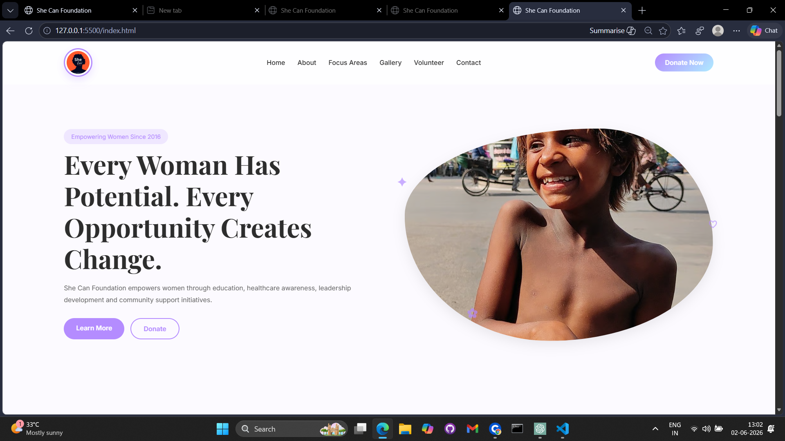
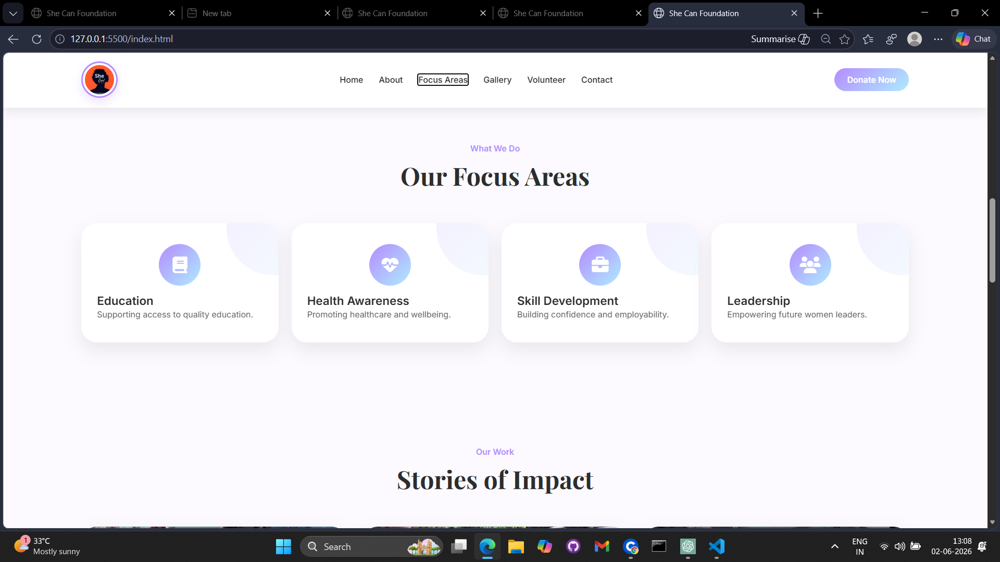
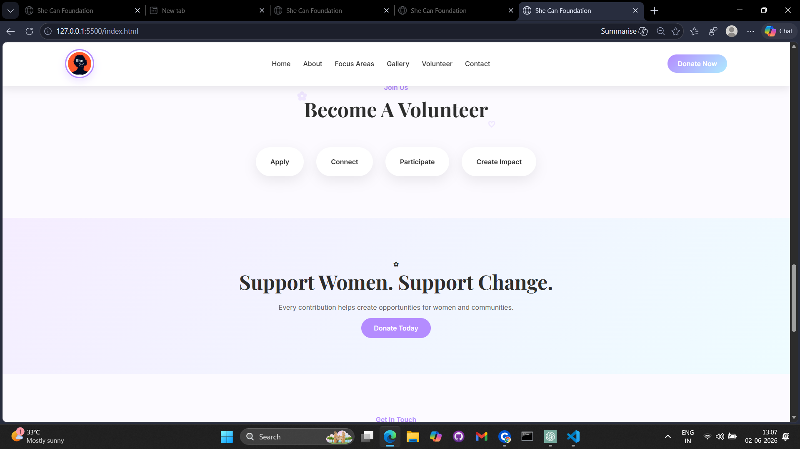
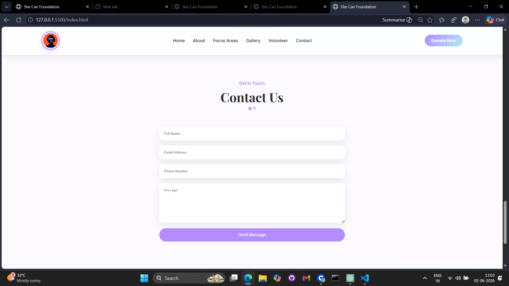

# She Can Foundation Website

A modern and responsive NGO website developed for She Can Foundation.

## About

This website was designed to showcase the mission, initiatives, impact, and volunteer opportunities of She Can Foundation.

The design focuses on:

- Clean UI/UX
- Responsive Layout
- Accessibility
- Modern NGO Presentation
- Easy Navigation

## Features

- Responsive Navigation Bar
- Hero Section
- About Section
- Focus Areas
- Gallery Section
- Volunteer Section
- Contact Form
- Social Media Links
- Modern Footer

## Technologies Used

- HTML5
- CSS3
- JavaScript
- AOS Animation Library
- Font Awesome Icons

## Project Structure

```text
SheCanFoundation/
│
├── index.html
├── style.css
├── script.js
│
├── assets/
│   ├── images
│   └── screenshots
│
└── README.md
```

## Screenshots

### Homepage


### Focus Areas


### Volunteer Section


### Contact Section


## Live Demo

website link :
https://rachana0106.github.io/she-can-foundation-website/

GitHub Pages Link:
https://github.com/Rachana0106/

## Author

Developed by Rachana makwana
